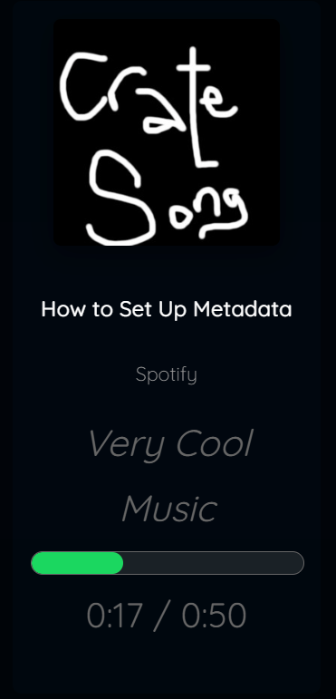
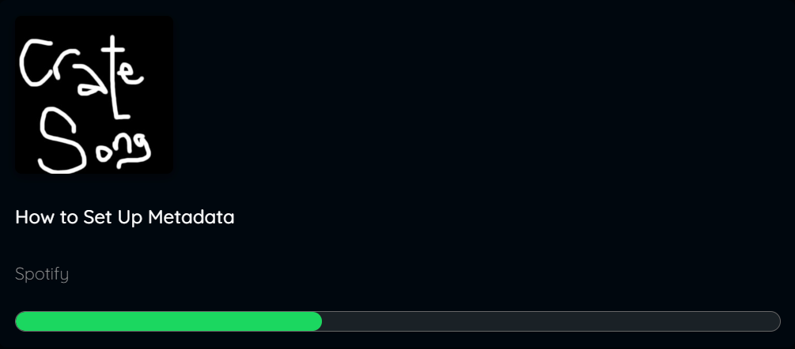
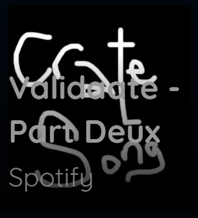

# MMM-POSpotify

A modern, minimalist Spotify module for [MagicMirror²](https://github.com/MichMich/MagicMirror) that displays your currently playing music with smooth animations and extensive customization options.

[](https://github.com/MichMich/MagicMirror)
[](https://raw.githubusercontent.com/rxf-sys/MMM-POSpotify/master/LICENSE)



## Features

**Modern Design**
- Multiple display modes (minimalist, detailed, compact, cover-only)
- Smooth progress bar animations
- Dynamic color extraction from album art
- Glass morphism and blur effects

**Highly Customizable**
- 4 built-in themes (dark, light, auto, glass)
- Custom accent colors
- Adjustable font sizes and text lengths
- Progress bar customization

**Advanced Features**
- Real-time playback controls (requires Spotify Premium)
- Touch/gesture support
- Low power mode for better performance
- Album art caching
- Automatic token refresh
- Static DOM updates for better performance

**Security First**
- Compliant with Spotify's latest security requirements
- Uses secure redirect URIs (127.0.0.1)
- Automatic token management
- No third-party services required

## Screenshots

| Minimalist | Detailed | Compact | Cover Only |
|------------|----------|---------|------------|
|  |  |  |  |

## Prerequisites

- MagicMirror² version 2.15.0 or higher
- Node.js version 14.0.0 or higher
- Spotify account (free or premium)
- [Spotify App](https://developer.spotify.com/dashboard) credentials

## Installation

### Step 1: Clone the module

```bash
cd ~/MagicMirror/modules
git clone https://github.com/rxf-sys/MMM-POSpotify.git
cd MMM-POSpotify
```

### Step 2: Install dependencies

```bash
npm install
```

### Step 3: Create a Spotify App

1. Go to [Spotify Developer Dashboard](https://developer.spotify.com/dashboard)
2. Click "Create an App"
3. Fill in the app details:
   - **App Name:** MagicMirror Spotify
   - **App Description:** Spotify module for MagicMirror
4. After creation, note your **Client ID** and **Client Secret**
5. Click "Edit Settings" and add the redirect URI:
   ```
   http://127.0.0.1:8100/callback
   ```
6. Save the settings

### Step 4: Authorize the module

#### Option A: Using the standalone authorization server

```bash
cd ~/MagicMirror/modules/MMM-POSpotify
node auth-server.js YOUR_CLIENT_ID YOUR_CLIENT_SECRET
```

Then open your browser and go to `http://127.0.0.1:8100`

#### Option B: Using the built-in authorization

1. Add the module to your config with just the Client ID and Secret
2. Start MagicMirror
3. Open `http://127.0.0.1:8100` in your browser
4. Click "Connect with Spotify" and authorize

### Step 5: Configure the module

Add the following to your `~/MagicMirror/config/config.js`:

```javascript
{
    module: "MMM-POSpotify",
    position: "top_right",
    config: {
        clientID: "YOUR_CLIENT_ID",
        clientSecret: "YOUR_CLIENT_SECRET",
        accessToken: "YOUR_ACCESS_TOKEN",        // From authorization
        refreshToken: "YOUR_REFRESH_TOKEN",      // From authorization
        displayType: "minimalist",               // minimalist, detailed, compact, coverOnly
        showAlbumArt: true,
        albumArtSize: 200,
        showProgressBar: true,
        theme: "dark"                            // dark, light, glass, auto
    }
}
```

## Configuration Options

| Option | Description | Type | Default |
|--------|-------------|------|---------|
| `clientID` | **Required** - Your Spotify App Client ID | `string` | `""` |
| `clientSecret` | **Required** - Your Spotify App Client Secret | `string` | `""` |
| `accessToken` | **Required** - Access token from authorization | `string` | `""` |
| `refreshToken` | **Required** - Refresh token from authorization | `string` | `""` |
| **Display Options** |
| `displayType` | Display style: `minimalist`, `detailed`, `compact`, `coverOnly` | `string` | `"minimalist"` |
| `updateInterval` | API update interval in milliseconds | `number` | `5000` |
| `animationSpeed` | Animation speed in milliseconds | `number` | `500` |
| `showAlbumArt` | Show album cover art | `boolean` | `true` |
| `albumArtSize` | Album art size in pixels | `number` | `200` |
| `showProgressBar` | Show playback progress bar | `boolean` | `true` |
| `progressBarHeight` | Progress bar height in pixels | `number` | `3` |
| `showDeviceIcon` | Show playback device icon | `boolean` | `true` |
| `showSpotifyLogo` | Show Spotify logo when not playing | `boolean` | `true` |
| `logoSize` | Spotify logo size in pixels | `number` | `30` |
| **Theming** |
| `theme` | Theme style: `dark`, `light`, `glass`, `auto` | `string` | `"dark"` |
| `accentColor` | Custom accent color (hex) | `string` | `"#1DB954"` |
| `useAlbumColors` | Extract colors from album art | `boolean` | `false` |
| `backgroundBlur` | Apply blur effect to background | `boolean` | `true` |
| **Text Options** |
| `showArtistFirst` | Show artist name before song title | `boolean` | `false` |
| `maxTitleLength` | Maximum title length before truncation | `number` | `30` |
| `maxArtistLength` | Maximum artist length before truncation | `number` | `25` |
| `scrollLongText` | Enable scrolling for long text | `boolean` | `true` |
| `fontSize` | Font size: `small`, `medium`, `large` | `string` | `"medium"` |
| **Advanced Features** |
| `showPlaybackControls` | Show play/pause/skip buttons (Premium required) | `boolean` | `false` |
| `enableNotifications` | Send notifications to other modules | `boolean` | `true` |
| `enableGestures` | Enable touch gesture support | `boolean` | `false` |
| `fadeWhenInactive` | Fade module when music stops | `boolean` | `true` |
| `inactivityTimeout` | Time before fading in milliseconds | `number` | `30000` |
| **Performance** |
| `lowPowerMode` | Reduce update frequency | `boolean` | `false` |
| `cacheAlbumArt` | Cache album covers | `boolean` | `true` |

## Display Types

### Minimalist (Default)
Clean layout with album art, title, artist, and progress bar side by side.

### Detailed
Vertical layout with larger album art, full album information, time display, and optional playback controls.

### Compact
Single-line horizontal layout ideal for small spaces.

### Cover Only
Full album art with overlay text, perfect for a visual focus.

## Notifications

### Sent Notifications
The module sends the following notifications when `enableNotifications` is true:

| Notification | Payload | Description |
|--------------|---------|-------------|
| `SPOTIFY_UPDATE` | `{title, artist, album, albumArt, progress, duration, isPlaying, device}` | Current playback information |

### Received Notifications
The module responds to these notifications:

| Notification | Payload | Description |
|--------------|---------|-------------|
| `SPOTIFY_PLAY` | none | Resume playback |
| `SPOTIFY_PAUSE` | none | Pause playback |
| `SPOTIFY_NEXT` | none | Skip to next track |
| `SPOTIFY_PREVIOUS` | none | Skip to previous track |
| `SPOTIFY_VOLUME_UP` | `number` (optional) | Increase volume |
| `SPOTIFY_VOLUME_DOWN` | `number` (optional) | Decrease volume |

## Troubleshooting

### No music showing
1. Ensure Spotify is actively playing on a device
2. Check that your tokens are valid by visiting `http://127.0.0.1:8100/status`
3. Verify your Spotify app has the correct redirect URI

### Authentication errors
1. Delete `.spotify-tokens.json` in the module directory
2. Re-run the authorization process
3. Make sure both `accessToken` AND `refreshToken` are in your config

### Progress bar not smooth
- Ensure you're using the latest version of the module
- Check that `updateInterval` is not set too high (5000ms recommended)
- Verify your system has sufficient resources

### Module not loading
Check the MagicMirror logs:
```bash
pm2 logs MagicMirror
```

## Updating

To update the module to the latest version:

```bash
cd ~/MagicMirror/modules/MMM-POSpotify
git pull
npm install
```

## Contributing

Contributions are welcome! Please feel free to submit a Pull Request.

1. Fork the repository
2. Create your feature branch (`git checkout -b feature/AmazingFeature`)
3. Commit your changes (`git commit -m 'Add some AmazingFeature'`)
4. Push to the branch (`git push origin feature/AmazingFeature`)
5. Open a Pull Request

## License

This project is licensed under the MIT License - see the [LICENSE](LICENSE) file for details.

## Acknowledgments

- [MagicMirror²](https://github.com/MichMich/MagicMirror) by Michael Teeuw
- [Spotify Web API](https://developer.spotify.com/documentation/web-api/)
- [spotify-web-api-node](https://github.com/thelinmichael/spotify-web-api-node)

## Author

- GitHub: [@rxf-sys](https://github.com/rxf-sys)